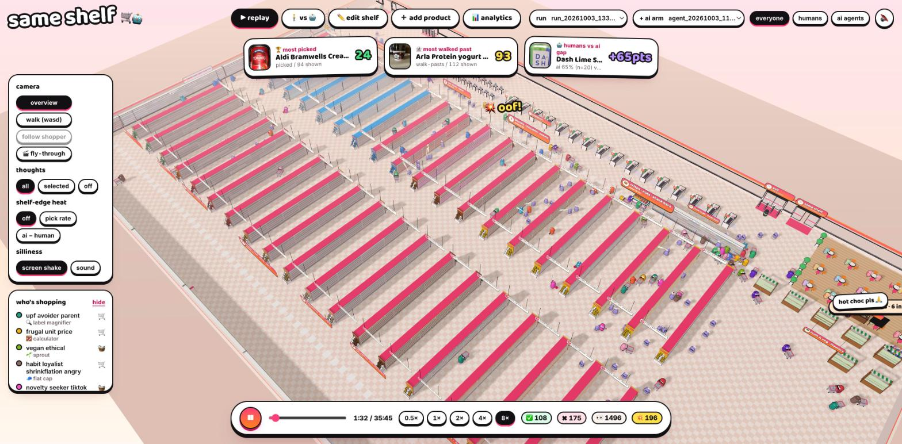
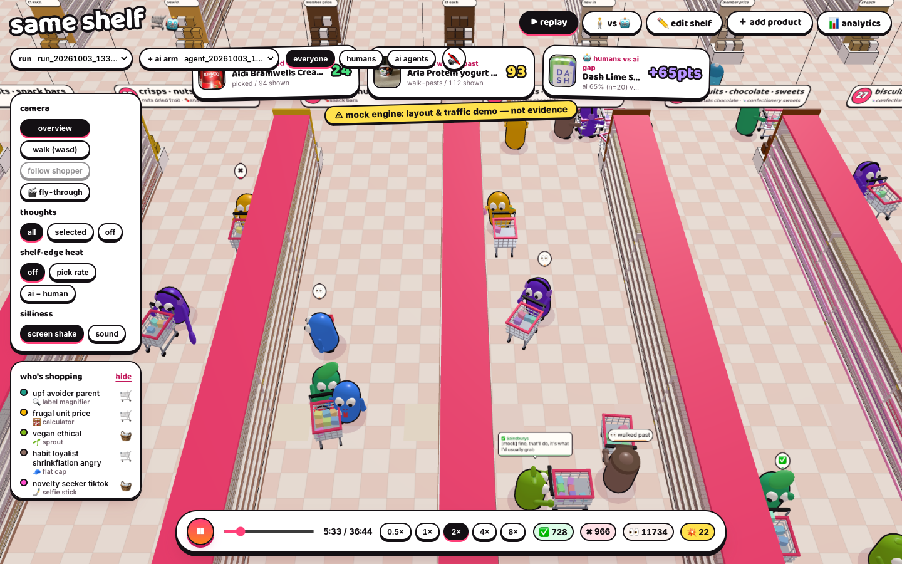
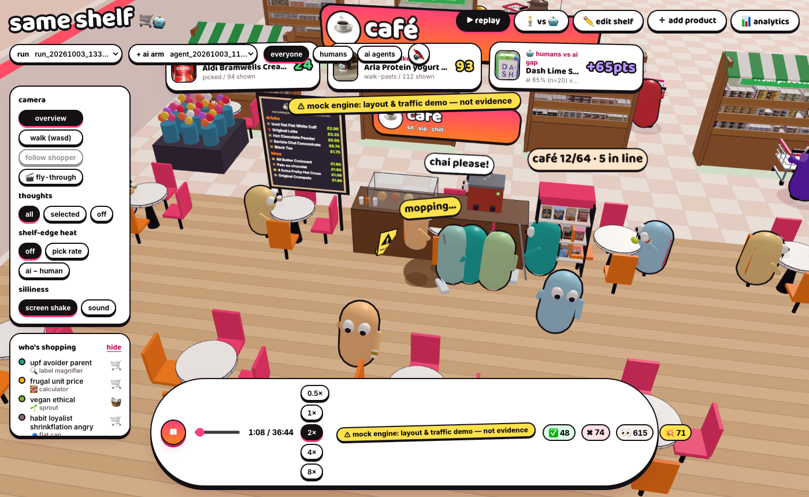
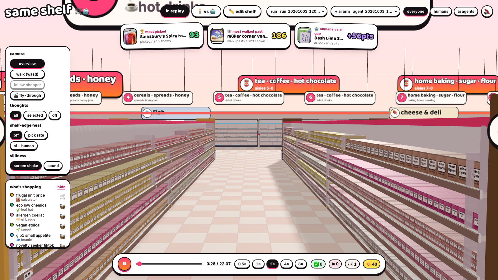
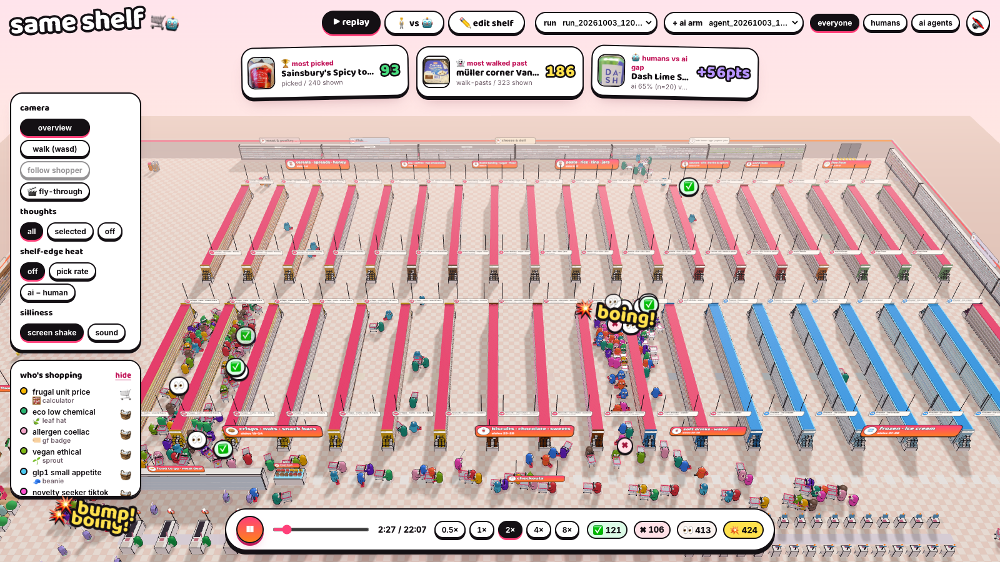
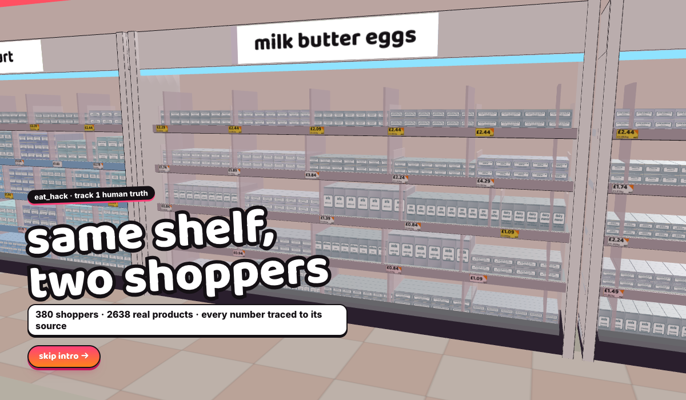

# simsbury 🛒🤖

**The shoppers EPOS never sees, traced to source.**

**EAT_HACK · Really Good Culture · 3 Oct 2026** · Track 1 *Human Truth* (with Retail Futures outputs) · team: `[FILL]` · repo: https://github.com/arvin-shafiei/eathackback

## ⛔ rule zero: we don't build a black box

RGC's judges say *"a number that cannot be traced back to its source is worse than no number at all."* So we hold ourselves to this standard:

- **Every number can be clicked down to its source.** That means an Open Food Facts field (barcode + field), a Jev probability (the exact question + answer distribution), a Reddit verbatim (thread URL), a paper or URL, real NielsenIQ sales (`data/sales/`), or a clearly **labelled assumption**.
- **Every persona shows its provenance:** Reddit threads → coded themes → behavioural mechanisms → the persona's lens weights, triggers and verbatims → the sim parameters it ends up with. You can see the breakdown visually on the dashboard.
- **Personas are editable, not magic.** A shop owner can build a new persona on the dashboard (OCEAN sliders, mission, budget, lens weights, triggers), run it through the store, and see why each of its decisions happened.
- **Arithmetic lives in code. Judgment lives in Jev**, which returns typed answers with calibrated probabilities. There is no generated prose pretending to be data.
- **It's enforced.** A Claude Code Stop hook (`.claude/hooks/blackbox-check.sh`) makes every work session end by answering *"is anything I just built a black box? if so, explain it."*

## the pitch

EPOS records the sale. It never sees the shopper who noticed a product, picked it up and put it back. **simsbury** (same shelf, two shoppers) is a 3D supermarket stocked with real UK products from Open Food Facts and walked by synthetic shoppers. Each shopper is grounded in 10,642 coded Reddit comments, published shelf-effect research and Big Five traits. Code decides what each shopper *notices*: shelf row, facings, centrality and mission, using a literature-calibrated logit. **TypeSafe Jev** then returns calibrated probabilities for *pick up → put back or take*, and for which of the shopper's rejection triggers fired. Every number clicks through to a paper, a Reddit thread, an Open Food Facts field, a Jev distribution or a labelled assumption. The tool gives brands a funnel diagnosis and legal pack-claim tests, and gives retailers an HFSS-aware layout optimiser. An AI-agent arm checks how a machine shopper reads the same range. **The non-obvious finding:** once noticed, challengers are picked up as often as incumbents but kept less often. They lose *in the hand*, at a stage EPOS can't see.

## three services (one engine)

Built for **small and independent supermarkets** that can't afford a dunnhumby-style insight team:

| for | the question | what simsbury does |
|---|---|---|
| 🏷️ **brands** | "Do shoppers look at my product, pick it up, then put it back or take it, and why?" | A per-product funnel (look → pick up → put back / take) by shopper type, showing the stage where the product loses people and the reason with its source. Plus a pack test using only true claims, and a shelf-placement search. |
| 🏪 **store owners** | "Where does it get congested, which shelf and which neighbours should a product go on, and what should I move?" | A traffic heatmap with congestion hotspots and dead zones, top / eye / bottom shelf guidance from the sourced notice model, adjacency tips from products bought together, and a rearrange plan you can test with simulated shoppers before applying it. |
| 🧺 **shoppers** | "The store keeps moving things, so where's my stuff, and what's new that I'd actually like?" | It logs what a new customer bought and builds their persona: likes, avoids and shopper type. Health traits are only used when the customer declares them. Their next visit gets a short route to their usual items wherever they've moved, plus **one** new item they'd probably like. |

Click any shopper, human or AI agent, to see **what it's thinking** (the recorded Jev probabilities), **what it's about to buy** and **what's in its trolley**.

## what's real vs simulated

- **REAL (TypeSafe Jev, calibrated):**
  - `run_20261003_120823_s11_jev_4482.json` (300 shoppers);
  - `agent_20261003_115907_s1_jev_5945.json` (80 AI-agent feeds);
  - the brand funnels in `data/sim/brand/`, which come from the Jev runs;
  - the pack tests in `data/sim/brand/pack_test/`;
  - the Jev surrogate in `data/sim/layout/surrogate.json`;
  - `data/sim/visits/` (96 shoppers, seeds 21–22).
- **REAL data, code-only (no model):**
  - products and claim checks against the 36,548-product UK Open Food Facts pool (`data/sim/swaps/claim_premium.md`);
  - HFSS scoring;
  - NielsenIQ ranks (`data/sales/uk_bestsellers.csv`).
- **MODELLED ON LABELLED ASSUMPTIONS:**
  - the layout optimiser's £ lift (85 of 96 prices are curator assumptions);
  - the store-ops day sim (self-checkout acceptance came from a fallback table because Jev ran out of credits);
  - OpenRouter LLM agent runs (uncalibrated comparison only);
  - `run_…_s909_jev_5c63.json`, which is `jev-router` (an OpenRouter LLM, uncalibrated) despite its filename.
- **MOCK (not evidence):**
  - the busy superstore / XL crowd replays, including the leaderboard stickers;
  - any run marked `_mock_`;
  - `calibration/out/DEMO_*`.

  The app stamps these with *"⚠ mock engine: layout & traffic demo, not evidence"* (`web/src/ui/engineBadge.tsx`). **No real-shopper calibration has been run yet.**

## quickstart

```bash
# 0. keys (only needed for NEW Jev runs; every REAL run above is in the repo and replays for $0)
cp .env.example .env        # TYPESAFE_API_KEY=... (Jev: $0.042 / 1M input tokens, output free; needs credits)
                            # OPENROUTER_API_KEY=... (optional: --engine llm, and the jev-router fallback on HTTP 402)
pip install requests typesafe-sdk

# 1. web app (3D store + evidence dashboard)
cd web && npm i && npm run dev
#   http://localhost:5173/?store=superstore&nointro    superstore crowd, queues, café   (MOCK replay)
#   http://localhost:5173/?store=standard&nointro      24-slot store: choose run_20261003_120823_s11_jev_4482 in "run" (REAL)
#   http://localhost:5173/?nointro                     XL store, where "＋ add product" (Tesco link / barcode) works
#   http://localhost:5173/dashboard.html               tabs: #personas #build #provenance #brand #retailer #shopper #ai
# after any new sim output: npm run sync && node scripts/sync-dashboard.mjs

# 2. sim server (add product, persona builder, re-run from the UI)
python3 sim/server.py                  # :8787, which the vite /api proxy targets
python3 sim/server.py 8788             # if 8787 is busy; open dashboard.html?api=http://localhost:8788/api
                                       # (the 3D app's add-product expects 8787; integrations/api_server.py also defaults to 8788)

# 3. sim CLI
python3 sim/run.py --agents 30 --seed 1                                    # Jev (default engine)
python3 sim/run.py --agents 30 --engine mock                               # $0, deterministic, NOT evidence
python3 sim/run.py --agents 120 --engine mock --seed 21 --store-format superstore   # superstore replay (gitignored; regenerate)
python3 scripts/slim_run.py data/sim/runs/<that run>.json && (cd web && npm run sync)
python3 sim/agent_shopper.py --runs 20                                     # AI-agent arm (Jev Choice over a shuffled feed)
python3 sim/layout_optimise.py --objective all --iters 20000 --seed 1      # retailer layout (data/sim/layout/)
python3 sim/notice.py                                                      # print the notice-model coefficients + sources
```

**Jev credits.** The TypeSafe API returned HTTP 402 (no credits) partway through the 12:36 visits run. In `auto` mode, `sim/jev.py` then switches to OpenRouter's `typesafe/jev-router` and marks every answer `calibrated: false`, and the app badges that run "jev-router (LLM, uncalibrated)". Set `JEV_BACKEND=typesafe` to refuse the fallback. **OpenRouter is a fallback and a comparison arm only. It is never the default engine.**

## headline evidence (REAL Jev runs only)

| claim | number | file (re-derive it yourself) |
|---|---|---|
| shoppers / product passes | 300 shoppers, 12 personas × 25, 19,992 shelf passes, 0 errors | `data/sim/runs/run_20261003_120823_s11_jev_4482.json` (`agents`, `cost.errors`) |
| funnel: noticed | 57.0% of passes [56.3, 57.7] | same file, `events[].stage_reached != "not_noticed"` |
| funnel: picked up, of noticed | 38.0% [37.1, 38.9] | same file, `picked_up + put_back` over looked |
| funnel: taken, of picked up | 55.9% [54.5, 57.4] | same file |
| take rate per pass | 12.1% [11.7, 12.6] | same file, `taken / passes` |
| take rate by role | own-label 20.0% [18.9, 21.3] · incumbent 11.0% [10.3, 11.7] · challenger 8.9% [8.3, 9.6] | same file, joined to `data/products/catalog.json → role` |
| **where challengers lose** | picked up when noticed: challenger 34.6% vs incumbent 33.9% (same). Kept once picked up: challenger **48.0%** [45.5, 50.5] vs incumbent 54.2% [51.7, 56.7] vs own-label 67.3% [64.7, 69.8] | same file, by role |
| biggest leak per challenger | put-back for 20 of 40 challengers, look for 11, pick-up for 5, too few passes for 4 | `data/sim/brand/index.json → products[].leak_stage` (3 Jev runs pooled) |
| AI agent: first-position bias | Jev 2.5% of picks at slot 1 [0.7, 8.7] vs 3.5% chance (n = 80). GPT-4.1-mini 16.3% (13/80) and Gemini 2.5 Flash 13.2% (10/76) | `data/sim/runs/agent_20261003_115907_s1_jev_5945.json → position_bias`; `agent_20261003_114253_s1_eda5.json` (OpenRouter comparison) |
| honest claim gap (OFF data, no model) | 22% of UK products with no fibre claim already qualify for "high fibre" (6,865 / 30,621) | `data/sim/swaps/claim_premium.md` §2 |
| a published null | route cards: basket completion +0.002 [0.000, +0.004], not a lift | `data/sim/visits/RESULTS.md` |
| a published null | best legal claim on Raspberry Probiotic Soda: Δ P(pick-up) +0.018, under the 0.02 noise floor | `data/sim/brand/pack_test/5060494810665.md` |
| cost | $0.87 for the 300-shopper run ($0.95 uncached), 6,187 requests, 22.7M input tokens, 223 s, which is **about $3.20 per 1,000 shoppers**. All Jev spend today: $2.69 over 19,580 calls | `sim/README.md` "Tested"; `run_…4482.json → cost`; `data/sim/cost_log.jsonl` |

CIs are Wilson 95%. The by-role split, the funnel conversions and the cost-log totals were re-derived from the run file with a few lines of Python over `agents[].events[]`; the definitions are in `stats.method` of the same file.

## screenshots

All of these are the **superstore / XL layouts replaying a MOCK run** (engine badge visible), shown for the 3D build, not for results.

| | |
|---|---|
|  superstore: 91 units, aisles, tills, café |  shoppers picking into baskets, with thought bubbles and the mock badge |
|  café: queue, seats, spill and cleaner |  aisle signage and shelf fill |
|  superstore layout |  intro fly-through |

---

## what it does: one engine, three surfaces (+ embed)

Every product has a **4-step funnel**: 👀 **look** → 🤚 **pick up** → ↩️ **put back** *or* 🧺 **take**. EPOS only sees the last step. We simulate all four, so we can say *where* a product loses people and *why*.

| surface | question | what it does |
|---|---|---|
| 🏪 **retailer / store owner** | "Which layout sells best, and which is easiest for my shoppers?" | Whole-store layout optimiser. Objective 1 is revenue and challenger exposure; objective 2 is shopper ease (shorter mission paths: put products where people already go). You can blend them. It respects the chilled-unit and UK HFSS placement rules, and shows before/after with CIs and a "move X to Y because…" diff. |
| 🏷️ **brand** | "Do people look, pick up, then put my product back, and why?" | Per-product funnel by persona and OCEAN segment. It diagnoses where people drop off: at *look* (shelf position/salience), at *pick-up* (the pack doesn't earn a second look), or at *put-back* (a label, price or trigger kills it, with the Jev probability and the Reddit verbatim). Plus a **pack test**: true claims the product qualifies for under Reg (EC) 1924/2006, tested for which version wins the pick-up. |
| 🧺 **shopper** | "What better option should I swap to?" | **Basket swaps**, e.g. a high-fibre alternative to an item in the basket, ranked by P(accept) × lens improvement. Shows the price delta, because claim-marketed products ("high fibre", "protein", "gut") usually carry a premium; we quantify that, and check whether the claim actually meets the legal threshold. |
| 🔌 **embed** | Use it inside retail workplaces and e-commerce | REST API (OpenAPI); a `<shelf-insight>` web component for product pages and intranets; an e-commerce search **re-ranker** per shopper type, with an agent-readiness check; a Slack brand digest; a Shopify mapping. |

**Engine: TypeSafe Jev** (System One). It returns calibrated probabilities instead of generated text: Choice for take / put-back / walk-past, Score for appeal, and Noul for each rejection trigger. Every "why" therefore comes with a probability, and the arithmetic stays in code. Jev costs $0.042 per million input tokens and output is free (docs.typesafe.ai/models). **Measured:** a 300-shopper run made 6,187 requests over 22.7M input tokens and cost $0.87, which is **about $3.20 per 1,000 shoppers**: roughly 415 typed answers per shopper in about 13 minutes per 1,000, with the 100k tok/s rate limit as the bottleneck (`sim/README.md`, `data/sim/cost_log.jsonl`). The default loop makes **no free-text LLM calls**. OpenRouter is used in only two places: the explicit `--engine llm` comparison runs, and the `jev-router` fallback that switches on when TypeSafe returns HTTP 402. Fallback answers are marked `calibrated: false` and badged in the app.

**What a real deployment collects:** shopping mission and why they're shopping (big shop vs top-up), dwell, pick-up and put-back (shelf sensors / on-device CV counts), and the e-commerce equivalents (impression → detail view → add-to-cart → remove → purchase). Everything is aggregated (k ≥ 10) and consented. See `docs/data-collection.md`.

**Rule we build by** (RGC's own words): *"A number that cannot be traced back to its source is worse than no number at all."*
- Every stat is a count of logged agent decisions.
- Every decision carries its persona, OCEAN scores, the product fields it read, its stated reason, and the source each assumption came from: a Reddit verbatim, a paper, or an OFF field.
- No black boxes.

## add your own product (brand upload)

A brand puts its own product on the shelf and watches the synthetic shoppers react, then changes something and re-tests.

1. **Add product** (mode in the 3D app): paste a Tesco product link or a barcode, or type the pack in. It takes the place of one product in a slot you choose.
2. **Run**: 150 shoppers and the AI-agent arm shop the store with it (`/api/run` and `/api/agent_run` with `products`).
3. **Analytics** (mode): picked / noticed / weighed-up against the unit median, a one-line diagnosis with its rule shown, funnel, breakdowns by shopper type, mission, OCEAN and AI archetype, a shopper behaviour log with CSV export, what it lost to, and rejection quotes that open the trace.
4. **Placement**: the notice rate of every row, position and facings in its unit (computed from `sim/notice.py`, no model call), then a same-seed before/after test on up to three spots with a 95% interval, and "apply and re-run".

Code: `sim/uploads.py`, `sim/tesco.py`, `sim/placement.py`, `web/src/insights.ts`, `web/src/ui/{AddProductPanel,InsightsPanel,PlacementSection}.tsx`.

## honest limitations

- Simulated personas are **hypotheses**, not data. That's why each one is grounded in quoted evidence and checked by a skeptic. Calibration path: real votes from The Shelf, plus an AIPW correction using 50–300 real responses (arXiv 2609.13148 reports 83–94% bias reduction).
- Reddit over-represents label-readers and list-makers. Counts are directional.
- The ACES coefficients come from non-food categories, so food-specific agent behaviour is measured live.
- Only **honest data edits** are allowed: filling in true missing facts, never adversarial prompt text.
- A brand-supplied product is **unverified**: every field is stamped `brand-supplied, unverified`, and its pack copy goes into the shopper prompt (length-capped, not filtered), so a brand could try to write instructions into it.
- **No real-shopper calibration yet.** The Shelf-vote harness is built (`calibration/`), but only `DEMO_*` (fake) outputs exist. Every result here is a simulation under stated assumptions.
- **Prices:** 85 of 96 catalogue prices are labelled curator assumptions (`data/sim/swaps/claim_premium.md`). Anything in £ (layout revenue, claim premiums) inherits that uncertainty.
- **Persona evidence:** lens personas are on average 28.4% assumption by field, with a range of 20.6–33.7% (`data/provenance/personas/index.json`). The dashboard prints this meter.
- **Jev credits ran out** (HTTP 402) during the 12:36 visits run. Several planned sweeps were not run (`data/sim/visits/RESULTS.md`), and the ops sim's self-checkout acceptance uses a labelled fallback table (`data/sim/ops/RESULTS.md`).
- **The AI-agent arm is small**: 80 Jev feeds. Position bias is measurable, but per-product human-vs-agent divergences have wide CIs.
- **The superstore / XL crowd replays are MOCK**: layout and traffic only, and badged as such.
- One run is **one trip per shopper**. The behaviour log's "buys per 100 visits" is within that run; repeat purchase and retention over time are not simulated for uploaded products. "Time at shelf" is each persona's `seconds_at_shelf` input, not a measured dwell.

## engine: typesafe jev

The shopper decisions in `sim/` are made by **TypeSafe Jev** (System One, `jev-1.13.0`), the default engine (`python3 sim/run.py --engine jev`). Code owns the walk, the notice model, every price and nutrition comparison, and the budget. Jev only answers narrow, typed questions about one shelf at a time. Full design: [`sim/README.md`](sim/README.md#engine-typesafe-jev-simjevpy).

**What we ask.** One request per (shopper, slot) carries every question for every product the shopper noticed ([speculative fan-out](https://docs.typesafe.ai/patterns/fan-out.md)):

- **Choice `decision`**: which noticed product the shopper takes, or `none` (walks past). Option order is shuffled and recorded, because Jev 1.13 can lean to the first option ([jaggedness #8](https://docs.typesafe.ai/model-jaggedness/jev-1.13.md)).
- **Noul `pickup_i`**: does the shopper pick this product up to look closer? This is the 👀 look → 🤚 pick-up step of the funnel. If a shopper who doesn't usually read labels picks something up, a second request re-judges with the back of pack revealed.
- **Score `appeal_i`** (5 levels, from "would actively avoid" to "really wants it"), mapped to sentiment −1..1 in code.
- **Noul per rejection trigger and trust signal** (the persona's top 3 + top 2): "Does `products[i]` show what `shopper.put_offs[k]` describes?". This is the *why*.
- **Choice `mechanism_i`**: habit, betrayal/loss aversion, price anchor, trust, gimmick reactance, social proof, health goal, mission fit, novelty, effort or indifference.

Jev never sees a raw number it would have to do maths on. Prices arrive as "about 2x the cheapest here", nutrition as UK traffic lights ("sugar: red (high)"), additives as "one or two additives" and processing as "ultra-processed (NOVA 4)" ([keep arithmetic in code](https://docs.typesafe.ai/model-jaggedness/jev-1.13.md)).

**Why calibrated probabilities make it traceable.** Every answer is a distribution, not prose: P(take) for each option, P(pick up), P(the card shows this put-off), and the appeal-level probabilities with a [confidence](https://docs.typesafe.ai/confidence.md) score. Code samples the take/put-back outcome from that distribution with a seeded, recorded draw. So any single decision can be replayed exactly, and the aggregate pick rate *is* the model's probability mass, not one verbose sample. The "why" is assembled from the evidence that fired, for example *"picked it up, put it back: sees 'Protein/new recipe claim carrying a price premium' (p=0.53)"*, followed by the persona's Reddit verbatim and URL. Each event stores the cache key of the exact state + questions + raw answer (`data/sim/cache/jev/`), so a judge can click from a stat to the question Jev was asked and the full distribution it returned. (`data/sim/cache/` is gitignored, so a fresh clone does not have the raw request bodies. The returned distributions themselves are stored in each event's `jev` block in the run file, which *is* in the repo.)

**Cost at scale** ($0.042 per 1M input tokens, output free; limits 80 req/s and 100k tok/s):

| run | requests | input tokens | cost | wall |
|---|---|---|---|---|
| 300 shoppers (seed 11, 96 SKUs, 24 slots) | 6,187 | 22.7M | $0.95 uncached ($0.87 actual) | 223 s |
| **per 1,000 shoppers** | ~20.6k | ~76M | **~$3.20** | ~13 min (limited by 100k tok/s) |
| AI-agent arm, per 1,000 feed sessions (24–36 items each) | 1,000 | ~8M | ~$0.34 | ~1 min |

That is about **$0.003 per shopper** for ~20 requests holding ~415 typed judgments, versus ~$0.006 per shopper for one free-text LLM call per slot. Re-runs with unchanged inputs are served from cache for $0.

**Result from the 300-shopper run:** 57% of product passes are noticed. Of noticed products, 38% are picked up, and 56% of pick-ups are taken. Take rate is 20.0% for own-label, 11.0% for incumbents and 8.9% for challengers. In the AI-agent arm, Jev shows **no first-position bias** (2.5% of picks at position 1 vs 3.5% expected by chance). In the earlier OpenRouter comparison run, Gemini 2.5 Flash put 13.2% of its picks at position 1 and GPT-4.1-mini 16.3% (about 4x and 5x chance); Claude Haiku 4.5 put 3.8% there, close to chance (`data/sim/runs/agent_20261003_114253_s1_eda5.json → position_bias`).

## the maths (explainable, no black box)

**Human shopper: notice → consider → choose**

- `P(notice_i) = σ(α₀ + α_v·vertical + α_c·centrality + α_f·ln(facings) + α_s·salience + α_e·endcap)`
  - Calibrated to the literature: eye level vs floor gives about **+39% sales**, best vs worst horizontal position about **+15%**, facings elasticity about **0.17**, top shelf about **+17% noticing** (Chandon et al. 2009; Drèze et al. 1994; Eisend 2014; Atalay et al. 2012).
- `P(i | noticed set) = exp(U_i) / (exp(U_0) + Σ exp(U_j))` with
  `U_i = β_p·ln(price) + β_trust·trust + β_h·habit + β_m·mission_fit + β_promo·promo + β_ol·own_label − β_r·gimmick_reactance`
  - Per-persona parameters come from the skeptic-calibrated persona simulation (see below).
  - Out of stock: 31% buy at another store, 26% switch brand, 19% switch to the same brand, 15% delay, 9% don't buy (Gruen, Corsten & Bharadwaj 2002).

**AI-agent shopper: conditional logit, with ACES coefficients per model**

- `U_j = β·x_j + γ·position_j + δ·sponsored_j + η·badge_j`
  - Example (Claude Sonnet 4): ln(price) −1.62, rating +4.91, ln(reviews) +0.42, sponsored −0.14, badge +1.06, row 1 +1.22.
- We also run **real LLM agents** on the same shelf as a JSON or HTML feed, with randomised positions, to check the parametric model against them live.

**Outputs**

- **Divergence** per product: `D_j = log(s^agent_j / s^human_j)`, with bootstrap CIs, plus shelf-level Jensen–Shannon divergence.
- **Attribution**: Shapley decomposition of *why* a product loses with agents (reviews, rating, price, claims, position, tags).
- **Breakthrough threshold**: the smallest *honest* change that lifts agent share to human share, `Δx_k = [logit(s^H) − logit(s^A)] / β_k`.
  - For example: "+31 reviews, *or* add the true 'high fibre' claim to the feed, *or* −£0.18/100g".
- **Shelf optimiser**: simulated annealing over slot swaps. It respects facings and the UK HFSS placement rules, and reports the lift per mission with CIs across seeds.

## the human truths (from 10.6k Reddit comments)

Full write-up: [`research/03-reddit-human-truths.md`](research/03-reddit-human-truths.md)

1. **A hidden change counts as a lie.** Shrinkflation and skimpflation trigger betrayal aversion, and staying unchanged is itself a value proposition (~320 comments).
2. **The weekly shop is a memorised route.** Disruption doesn't create discovery; it creates abandonment (~290). *"It makes me spend less as I can't be bothered to look for it"* (r/britishproblems, 507 upvotes).
3. **Shoppers pick channels to control themselves.** Online and click-and-collect act as precommitment against impulse buying (~200).
4. **Fairness is judged against whatever sits next to the product.** Own-label anchoring; fake anchors still work (~300).
5. **Trust is borrowed** from insiders, negative reviews and named manufacturers, not built by the brand (~280).
6. **Every household has 1–3 "sacred" SKUs** that nobody substitutes (~330).
7. **"Too expensive" is cover** for effort, waste risk and pleasure (~330).
8. **People push back once they see they're being played** (protein-gimmick reactance, forced AI pop-ups).

## why this, why now

| | |
|---|---|
| **RGC's own thesis** | EPOS *"says nothing about … the shoppers who walked past without buying"* (David, co-founder). Synthetic shoppers are *"only as credible as the behavioural data underneath them"* (Ege). Challengers face the circular *"need the listing to get the data"* problem (Adam). |
| **The gap** | All 7 of RGC's intelligence dimensions model **human** shoppers. None models the **agent shopper** that is arriving now: Tesco's in-app assistant (2026 rollout), ChatGPT Instant Checkout, Rufus, Google AI Mode. |
| **IGD** | *"It is machine visibility, not shelf visibility, that shapes choice."* |
| **Agents choose differently** | ACES (Allouah et al. 2025, arXiv 2508.02630): strong position bias that **flips between model versions** (GPT-4.1 favours slot 1, GPT-5.1 penalises it), sponsored-tag penalty, demand concentrated on modal products, shares reshuffled by model updates. *Incumbent Advantage*: at equal specs, incumbents are picked 100% of the time, and a +0.075★ edge flips 50% of choices. |
| **Challengers are already invisible** | 71% of new UK launches sat outside the top 100 search results or were missing entirely. About 76% of new lines fail in year 1. |
| **Nobody measures this for food** | No published study pairs LLM-agent choices with human choices on food or front-of-pack cues. |

## the personas (simulated in stages)

We built 13 evidence-grounded personas. Each was run through a 5-stage journey on the *same* test shelf, then **adversarially checked by a skeptic agent** that returned calibrated sim parameters.

- **Shoppers:** Priya (Ocado parent who says she avoids UPF), Jordan (Gen Z, delegates to ChatGPT), Margaret (in-store loyalist, angry about shrinkflation), Sam (GLP-1 user), Dev (frugal own-label student).
- **Founders:** Ellie (Nutty Crunch, range review looming), Marcus (Gutsy Pop: TikTok spike, thin data).
- **Buyers:** Aisha (Ocado digital range), Tom (Tesco buyer in a 2-year rotation), Rachel (retail media).
- **Agents:** Agent-GPT, Agent-Tesco.
- **Internal:** Ege (RGC AI engineer).

Results: [`research/05-personas.md`](research/05-personas.md)

## who pays

| payer | why | anchor |
|---|---|---|
| **Challenger brands** (RGC Club: 400+ brands, 1,000+ on the newsletter) | Agent-readiness audit plus breakthrough threshold per SKU, and evidence for the buyer meeting | Watch Humans Retail Report £999 add-on; digital-shelf tools ~£10–50k a year |
| **Retailers / online grocers** (Ocado, Tesco/dunnhumby, Nectar360) | Range and layout what-ifs by mission; whether agent baskets collapse range diversity; whether sponsored slots lose value | Virtual-store studies ~£20–60k each, taking weeks |
| **RGC** | An **8th dimension, "Agent"**, for Breakthrough, which Aaru, Simile and Electric Twin don't have | New product line |

## repo

- `brief/`: challenge brief
- `research/`
  - `00-rgc-intel.md`: what RGC sells, their blog theses
  - `01-concept-3d-store.md`: the concept
  - `02-issue-discovery.md/.json`: research across 8 angles plus the judge's ranking of 20 candidate issues
  - `03-reddit-human-truths.md`, `03-reddit-coded.json`: behavioural coding of 10.6k comments
  - `04-3d-sim-evidence-and-tech.md`: shelf-effect numbers, ACES agent coefficients, choice model, stack
  - `05-personas.md`: staged persona simulation
  - `corpus/`: top comments per theme (inputs for the coding agents)
- `data/reddit/`: raw corpus (133 threads, 10,642 comments; JSONL, CSV, one JSON per thread). See `data/README.md`.
- `scripts/`: data collection (Arctic Shift Reddit archive)
- `design/`: design language (tokens, component references, visual references)
- `.claude/skills/`: superpowers + impeccable skills
- `sim/`: the engine.
  - `run.py`: human shoppers;
  - `notice.py`: notice gate;
  - `jev.py`: Jev client and cache;
  - `agent_shopper.py`: AI-agent arm;
  - `optimise.py`, `layout_optimise.py`, `placement.py`: optimisers;
  - `pack_test.py`, `swaps.py`, `visits.py`, `routes.py`, `ops.py`;
  - `uploads.py`, `tesco.py`: brand upload;
  - `server.py`: API.

  See [`sim/README.md`](sim/README.md).
- `web/`: the 3D store ([`web/README.md`](web/README.md)) and the evidence dashboard ([`web/DASHBOARD.md`](web/DASHBOARD.md)).
- `data/sim/`: every output.
  - `runs/`: replayable run logs;
  - `brand/`: per-product funnels and pack tests;
  - `layout/`: retailer optimiser;
  - `swaps/`: shopper swaps and claim premium;
  - `visits/`: route-card experiment, a null;
  - `ops/`: store-ops day sim;
  - `cost_log.jsonl`: every paid call.
- `data/products/`: OFF catalogues (96 curated, 480 XL, 2,638 superstore).
- `data/store/`: layouts, plus `formats/` for express, metro and superstore.
- `data/personas/`: lens personas and OCEAN effect files.
- `data/provenance/`: persona evidence graph.
- `data/sales/`: NielsenIQ tables as published.
- `calibration/`: Shelf-vote harness (built; only DEMO outputs so far).
- `integrations/`: REST API (OpenAPI), `<shelf-insight>` widget, e-com re-rank, Slack digest, Shopify design.
- `pitch/`: submission text, demo script, judge Q&A.
- `docs/screens/`: screenshots.

## stack

- **3D store:** Vite + React + TypeScript + three.js / react-three-fiber + drei, with procedural low-poly geometry and walkway waypoint routing (`web/src/layout.ts`).
- **Dashboard:** a second Vite page, `web/dashboard.html`.
- **Products:** Open Food Facts product data and images (UK).
- **Sim:** Python 3 (stdlib + `requests` + `typesafe-sdk`), with a literature-calibrated notice model in code and TypeSafe Jev for every shopper and AI-agent judgment.
- **OpenRouter:** only for the explicit `--engine llm` comparison and the labelled `jev-router` fallback.

---

## background: how the idea started (kept for the record)

This section was written before the build. Where it differs from what was built, the sections above are authoritative.

### the original idea (v2, locked 3 Oct, 11:15)

**Deep synthetic shoppers walk a 3D store, read real products, and every number they produce traces back to a source.**

1. **3D store (three.js / react-three-fiber).** Keep it simple and expandable.
   - 4 aisles with a divider down each, giving **8 shelving units × 3 rows = 24 slots**.
   - Each slot holds a *set* of items: one product family, the challenger next to its incumbent and the own-label version.
   - Layout comes from a config file, so it scales to more aisles, rows and items.
2. **Real products, real descriptions.** UK products from **Open Food Facts**: name, brand, pack copy, ingredients, additives (E-numbers), NOVA processing level, Nutri-Score, eco-score, labels (organic, vegan, Fairtrade), allergens, price per unit where available, and the image.
   - Every attribute links back to its OFF product page by barcode.
3. **Deep synthetic audiences using OCEAN (the Big Five).** Each shopper has Big Five trait scores *plus* a grounded persona: mission, budget, channel and habits, taken from the 13 evidence-grounded personas and 10.6k coded Reddit comments.
   - Traits map to shopping behaviour through **published links**, for example:
     - Openness → food neophilia and trying challengers
     - Conscientiousness → label reading and health-driven choice
     - Neuroticism → risk aversion, loss aversion and health anxiety
     - Agreeableness → ethical and eco concern
     - Extraversion → social proof and impulse
   - Decisions run on **TypeSafe Jev**, which returns typed answers with calibrated probabilities. *(Status 14:20:* OpenRouter LLMs are no longer the decision engine. They remain only as an explicit `--engine llm` comparison and as the `jev-router` fallback on HTTP 402, labelled uncalibrated.*)*
4. **What each persona looks for, made explicit.** Every persona has a weighted **attribute lens**. The eco-minded parent looks for fewer additives, organic, eco-score A/B and recyclable packaging. The GLP-1 user looks for small portions, high fibre and low sugar. The frugal student looks for price per 100g and meal-deal eligibility. The protein-sceptic looks for the "gimmick" cue.
   - We **pick products to span those lenses**: high and low additives, NOVA 1→4, organic vs not, challenger vs incumbent vs own-label, cheap vs premium.
   - Each product is **graded per lens** with a visible, traceable score.
5. **Agents shop.** Each one walks the aisles, *notices* items (driven by shelf position and salience), *reads* the description, then *chooses, rejects or walks past*, and says **why in its own words**. That reason is tagged to the lens attribute and the behavioural mechanism it came from.
6. **Stats for brands.** Per product:
   - notice rate, consideration, pick share and walk-past rate, by persona, OCEAN segment and mission;
   - the top rejection reasons;
   - the **predicted sentiment** ("how shoppers would feel about it");
   - an AI-agent shopper comparison (human ↔ agent divergence).
7. **Optimisation for brands.** The system tests honest changes and re-runs the store to show the lift with a confidence interval: shelf slot, facings, pack claim, description rewrite (true facts only), price, own-label adjacency.
   - Output: *"move to eye level: +X% notice; add the true 'high fibre' claim: +Y% pick among conscientious, GLP-1 shoppers."*

### the original agent-shopper framing

> *"Your product won the room today. Here's why the robot that will shop for those same people in 2027 won't pick it, and the one honest fix that changes that."*

A **3D supermarket** stocked with real UK products. Two kinds of shopper walk the **same shelf**:

1. **Human shoppers**: agents grounded in evidence, each on a mission (meal-deal lunch, big weekly shop, top-up, GLP-1 user, frugal student…). They notice, consider, choose, **reject or walk past** products. The rules come from **10,642 real Reddit comments** coded into behavioural mechanisms and from shelf-effect literature.
2. **AI shopping agents**: ChatGPT, Claude and Gemini style agents, plus a retailer assistant such as the Tesco Clubcard agent. They "shop" the same range as a product feed. They can't taste, can't see eye level and never walk away. They read structured data, penalise "sponsored" tags and pile onto a few modal products.

We measure the **human ↔ agent divergence** for every product. We render the **walk-pasts** (the shoppers EPOS never sees). Then an optimiser **rearranges the shelf and the data** and re-runs, showing which challenger brand goes from *walked past* to *picked up*, by mission and by shopper type.

### pressure test (honest, written at 11:15 before the build)

| attack | risk | answer / mitigation |
|---|---|---|
| **"It's a synthetic persona panel. RGC already shipped Buyer Agent and Signal Twins (Apr 2026)."** | 🔴 high | Don't pitch "personas". Pitch **grounding + traceability + space**. RGC's twins have no shelf, no walk-past and no agent-shopper arm. Lead with the 3D walk-past and the trace for each decision, not the panel. |
| **"LLM personas are too rational and too positive"** (NN/g: chatbots "want to please"; arXiv 2609.13148: subgroup error 10–30pp, WTP overstated ~3×). | 🔴 high | (a) A **notice gate before the LLM**: most products are never seen, decided by a literature-calibrated shelf model, not the LLM. (b) A forced **walk-past / no-buy** option and a budget. (c) Several models via OpenRouter. (d) A **calibration check** against real votes from The Shelf today (25 brands, 50 builders), reported honestly. *Status 14:20:* (a), (b) and (c) are built. Jev replaced the OpenRouter models as the engine, and they are kept as a comparison arm. (d) The harness is built (`calibration/`), but only `DEMO_*` (fake) outputs exist, so **no calibration result is claimed**. |
| **"OCEAN is pop-psych."** | 🟠 med | Use only trait→food-behaviour links with citations (e.g. openness ↔ food neophilia/variety seeking; conscientiousness ↔ healthier eating and label use; neuroticism ↔ emotional eating and risk aversion). Show the link and source on hover. Traits are a *modifier* on grounded personas, not the whole model. |
| **"The 3D is eye candy."** | 🟠 med | The 3D *is* the data: shelf position drives P(notice) with cited effects (eye level ~+39% sales, facings elasticity ~0.17). The walk-pasts are visible. Ugly-but-true beats pretty-but-fake: 24 slots, boxes plus product images. |
| **"Can you build it by 17:30?"** | 🟠 med | Scope: one store, 24 slots, ~50–70 products, ~200 agent runs, one optimisation loop. Pre-compute runs and render replays; the live demo shows replay plus one live re-run. A fast utility model handles noticing; the LLM handles read-and-decide only for noticed items. |
| **"Where's the money?"** | 🟢 low | Challenger brands (RGC Club: 400+) want buyer-meeting evidence before listing; retailers want layout and range what-ifs. Anchors: the £999 Retail Report add-on; virtual-store tests at £20–60k taking weeks. |
| **"Scraped Tesco data?"** | 🟠 one page, on request | The catalogue is **Open Food Facts** (open licence, ingredients, additives, NOVA, eco-score). The one exception: when a brand pastes a Tesco link for its own product, `sim/tesco.py` opens that single page in a browser window and reads the schema.org block Tesco publishes for search engines (name, price, image, barcode); everything else comes from Open Food Facts by that barcode. Nothing is crawled, and a barcode works with no Tesco request at all. A production version would need Tesco's permission or a licensed product feed. |
| **"Is the agent-shopper arm a gimmick?"** | 🟢 low | It's the most original part: no RGC dimension covers it, and IGD/Kantar are warning about exactly this. Same products, structured feed, ACES-style randomised positions, report divergence. |

**Verdict:** build it, but **lead with traceable grounding**: "why did shopper #37 walk past Nutty Crunch?", answered by shelf slot, notice probability, OCEAN trait, the attribute read, a Reddit verbatim and the source. The personas and the 3D are how we deliver that, not the pitch itself.
